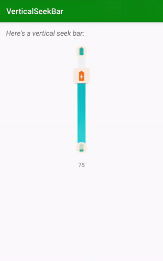

VerticalSeekBar
===============

[](https://opensource.org/licenses/Apache-2.0) [](http://developer.android.com/index.html) [](https://android-arsenal.com/api?level=16) [](https://jitpack.io/#lukelorusso/VerticalSeekBar) [](https://androidweekly.net/issues/issue-377)

## Presentation ##



This is the source code of an Android library: `-=:[ VerticalSeekBar ]:=-`

📃 Check also the [**Medium article**](https://blog.usejournal.com/android-a-custom-vertical-seekbar-how-to-reinvent-the-wheel-c07f28960f8f?source=friends_link&sk=eb8917b7f046a2152066ce8b58c81c7b) about it!

- - -

## Why would you need it? ##

*"Reinventing the wheel is, most of the time, a bad idea."*  
If you've ever tried to make a vertical SeekBar work properly, you know this is not the case. 😏  
From the moment you apply that `android:rotation="270"` all start to get messy: you cannot set the proper height for the drawable; the width of the bar distorts the width of your drawable; even customizing your interaction with the bar is kind of tricky.  
I've been through all of this and suddenly I've had enough.

**Introducing a nicer, redesigned and highly customizable VerticalSeekBar.**

What you got:
- custom progress drawable: apply resources or color gradients
- custom thumb: chose your size, background color, corner radius or even to completely hide it
- view width and drawable width completely separated
- choose how to set your progress (just sliding the thumb, clicking around, or both)
- min and max placeholders
- much more!

- - -

## How to use it? ##

Step 1. add the JitPack repository to your ROOT build.gradle at the end of repositories:

```groovy
allprojects {
    repositories {
        ...
        maven { url 'https://jitpack.io' }
    }
}
```

Step 2. add the dependency:

```groovy
    implementation 'com.github.lukelorusso:VerticalSeekBar:1.2.5'
```

That's it!

Now you can add the view to your layout:
```xml
<com.lukelorusso.verticalseekbar.VerticalSeekBar
        android:layout_width="160dp"
        android:layout_height="280dp"/>
```  

maybe add some attributes... here you got some, we'll discuss them later
```
        ...
        app:vsb_click_to_set_progress="false"
        app:vsb_bar_corner_radius="15dp"
        app:vsb_bar_width="60dp"
        app:vsb_bar_background="#eeeeee"
        app:vsb_bar_progress_gradient_end="#4dd0e1"
        app:vsb_bar_progress_gradient_start="#03a2ba"
        app:vsb_max_placeholder_position="inside"
        app:vsb_max_placeholder_src="@drawable/max_placeholder"
        app:vsb_min_placeholder_position="inside"
        app:vsb_min_placeholder_src="@drawable/min_placeholder"
        app:vsb_progress="50"
        app:vsb_show_thumb="true"
        app:vsb_thumb_container_corner_radius="5dp"
        app:vsb_thumb_container_tint="@color/placeholderBackground"
        app:vsb_thumb_placeholder_src="@drawable/thumb_placeholder"
        app:vsb_use_thumb_to_set_progress="true"
        ...
```  

All of them can be also set programmatically.

(Please note: it's strongly recommended to avoid pre-1.2.0 versions due to inconsistencies compared to this guide)

## For Java projects ##

Someone experienced this `InflateException`. For those guys, it's worth noticing that this is a KOTLIN library! The reason why you're getting an `InvocationTargetException` is because, in case you're still on Java, you also have to specify:

```gradle
implementation 'org.jetbrains.kotlin:kotlin-stdlib:1.3.+'
// or one of the -jre7, -jre8 stdlib depending on your config
// put the most up-to-date version
```

on your app module's `build.gradle`.

Another solution is just to... migrate to Kotlin guys!

- - -

# Attributes #

## Background and Progress ##

To set your progress value programmatically:
```kotlin
mainVerticalSeekBar.progress = 75
```

Do you need a smaller or bigger range? You can change `maxValue` like this:
```kotlin
mainVerticalSeekBar.maxValue = 70 // "progress" will be automagically reduced!
```

Let's put some color on this view, shall we?    
You can set a drawable for the background and a drawable for the progress. If you don't, default colors will be applied.

For both **background** and **progress** you have 3 choices:
- set a start color and an end color, the view will create a gradient for you
- set a drawable resource or color (REMEMBER: this choice has priority on the one before)
- just don't choose (it's still a choice anyway 😉)

Example for the first choice: apply a gradient
```kotlin
mainVerticalSeekBar.barBackgroundStartColor = ContextCompat.getColor(this, R.color.my_background_start_color)
mainVerticalSeekBar.barBackgroundEndColor = ContextCompat.getColor(this, R.color.my_background_end_color)
mainVerticalSeekBar.barProgressStartColor = ContextCompat.getColor(this, R.color.my_progress_start_color)
mainVerticalSeekBar.barProgressEndColor = ContextCompat.getColor(this, R.color.my_progress_end_color)
```

Example for the second choice: apply a resource (will eventually override the first one)
```kotlin
mainVerticalSeekBar.barBackgroundDrawable = getDrawable(R.color.my_background_color)
mainVerticalSeekBar.barProgressDrawable = getDrawable(R.drawable.my_progress)
```

Your bar can also have rounded corners...
```kotlin
mainVerticalSeekBar.barCornerRadius = 40 // those are pixels
```

...and a proper independent width
```kotlin
mainVerticalSeekBar.barWidth = 30 // those are pixels
```

## Placeholders ##

To set minimum and/or maximum placeholders (`null` is a possible value to remove them):
```kotlin
mainVerticalSeekBar.minPlaceholderDrawable = getDrawable(R.drawable.my_min_placeholder)
mainVerticalSeekBar.maxPlaceholderDrawable = getDrawable(R.drawable.my_max_placeholder)
```

Since v1.1.4 you can also choose placeholders' position  
You can choose between `{"inside", "outside", "middle"}` (`"middle"` by default)  
Programmatically, it will be:
```kotlin
mainVerticalSeekBar.minPlaceholderPosition = VerticalSeekBar.Placeholder.INSIDE
mainVerticalSeekBar.maxPlaceholderPosition = VerticalSeekBar.Placeholder.OUTSIDE
```

Now about the thumb placeholder 👆  
It is child of a `androidx.cardview.widget.CardView`. You can choose the color tint and the corner radius of the CardView:
```kotlin
mainVerticalSeekBar.thumbContainerColor = ContextCompat.getColor(this, R.color.my_thumb_background_color)
mainVerticalSeekBar.thumbContainerCornerRadius = 15 // those are pixels
```

You can set your thumb drawable like this:
```kotlin
mainVerticalSeekBar.thumbPlaceholderDrawable = getDrawable(R.drawable.my_thumb_placeholder)
```

If you just don't want to see it:
```kotlin
mainVerticalSeekBar.showThumb = false
```

## Interaction ##

You can interact with your VerticalSeekBar in two ways:
- sliding the thumb
- tapping on the bar

Both those interactions can be disabled if you like (they are `true` by default).  
For instance, It can be useful to disable sliding in case you need to put the VerticalSeekBar on a ScrollView.  
To do so:
```kotlin
mainVerticalSeekBar.useThumbToSetProgress = false
mainVerticalSeekBar.clickToSetProgress = true
```

Try to change those booleans too see other possibilities!

## Listeners ##

You have the possibility to set a listener for progress changes:

```kotlin
mainVerticalSeekBar.setOnProgressChangeListener { progressValue ->
    Log.d("VerticalSeekBar", "PROGRESS CHANGED at value: $progressValue")
}

mainVerticalSeekBar.setOnPressListener { progressValue ->
    Log.d("VerticalSeekBar", "PRESSED at value: $progressValue")
} // since v.1.2.2 thanks to https://github.com/ModischFabrications

mainVerticalSeekBar.setOnReleaseListener { progressValue ->
    Log.d("VerticalSeekBar", "RELEASED at value: $progressValue")
} // since v.1.2.2 thanks to https://github.com/ModischFabrications
```

This is how it will look like using **Java**:
```java
VerticalSeekBar mainVerticalSeekBar = findViewById(R.id.mainVerticalSeekBar);
mainVerticalSeekBar.setOnProgressChangeListener(
    new Function1<Integer, Unit>() {
        @Override
        public Unit invoke(Integer progressValue) {
            Log.d("VerticalSeekBar", "PROGRESS CHANGED at value: " + progressValue);
            return null;
        }
    }
);
mainVerticalSeekBar.setOnPressListener(
    new Function1<Integer, Unit>() {
        @Override
        public Unit invoke(Integer progressValue) {
            Log.d("VerticalSeekBar", "PRESSED at value: " + progressValue);
            return null;
        }
    }
);
mainVerticalSeekBar.setOnReleaseListener(
    new Function1<Integer, Unit>() {
        @Override
        public Unit invoke(Integer progressValue) {
            Log.d("VerticalSeekBar", "RELEASED at value: " + progressValue);
            return null;
        }
    }
);
// Too much verbose for you? Time to migrate to Kotlin!
```

## Still want more? ##

If this level of customization is not enough, I have one last good news for you: the seekbar layout is ENTIRELY CUSTOMIZABLE!

You can pick the original [**layout_verticalseekbar.xml**](/verticalseekbar/src/main/res/layout/layout_verticalseekbar.xml) and put it in your project's `res/layout` folder.

Now you can modify it as you wish; just remember to keep all the original ids! 😉 (`thumbCardView` and `thumbPlaceholder` can be safely removed)

- - -

# Explore! #

Feel free to checkout and launch the example app 🎡

Also, see where using this library has been the perfect choice:

[](https://play.google.com/store/apps/details?id=com.lukelorusso.colorblindclick)  
[**ColorBlindClick**](https://play.google.com/store/apps/details?id=com.lukelorusso.colorblindclick)


[](https://play.google.com/store/apps/details?id=fr.siaci.myprevention)  
[**MyPrevention**](https://play.google.com/store/apps/details?id=fr.siaci.myprevention)

- - -

# Copyright #

Make with 💚 by [Luca Lorusso](http://lukelorusso.com), licensed under [Apache License 2.0](http://www.apache.org/licenses/LICENSE-2.0)  
Thanks for the help to [Lopez Mikhael](http://mikhaellopez.com/)
